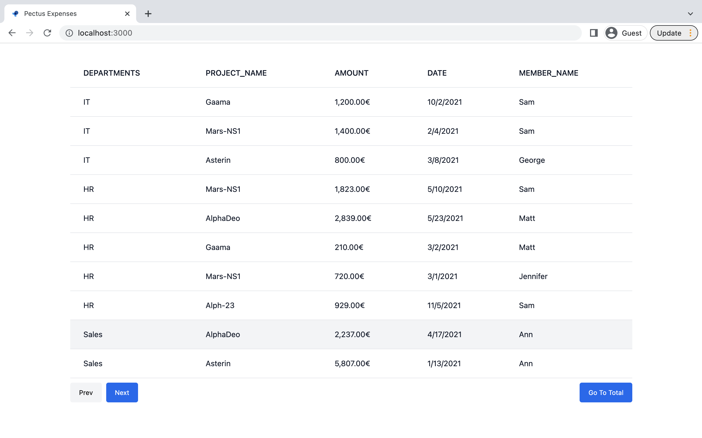
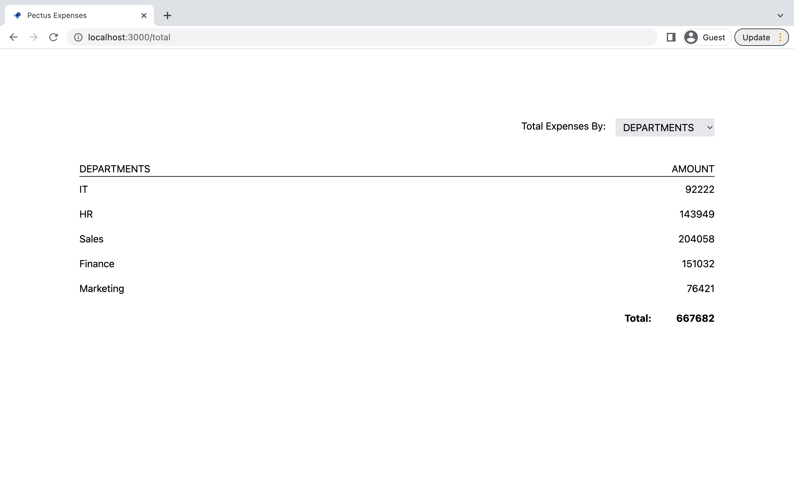

# Getting Started with Create React App

This project was bootstrapped with [Create React App](https://github.com/facebook/create-react-app).

## Available Scripts

In the project directory, you can run:

### `npm start`

Runs the app in the development mode.\
Open [http://localhost:3000](http://localhost:3000) to view it in the browser.

The page will reload if you make edits.\
You will also see any lint errors in the console.

### `npm test`

Launches the test runner in the interactive watch mode.\
See the section about [running tests](https://facebook.github.io/create-react-app/docs/running-tests) for more information.

### `npm run build`

Builds the app for production to the `build` folder.\
It correctly bundles React in production mode and optimizes the build for the best performance.

The build is minified and the filenames include the hashes.\
Your app is ready to be deployed!

See the section about [deployment](https://facebook.github.io/create-react-app/docs/deployment) for more information.

### `npm run eject`

**Note: this is a one-way operation. Once you `eject`, you can’t go back!**

If you aren’t satisfied with the build tool and configuration choices, you can `eject` at any time. This command will remove the single build dependency from your project.

Instead, it will copy all the configuration files and the transitive dependencies (webpack, Babel, ESLint, etc) right into your project so you have full control over them. All of the commands except `eject` will still work, but they will point to the copied scripts so you can tweak them. At this point you’re on your own.

You don’t have to ever use `eject`. The curated feature set is suitable for small and middle deployments, and you shouldn’t feel obligated to use this feature. However we understand that this tool wouldn’t be useful if you couldn’t customize it when you are ready for it.

## Learn More

You can learn more in the [Create React App documentation](https://facebook.github.io/create-react-app/docs/getting-started).

To learn React, check out the [React documentation](https://reactjs.org/).

## Pectus finance frontend Task

Below is a picture of the firstpage displaying Table with the expenses data

Clicking on each header column will format the table in ascending/descending order according to the data in that header

I also implemented Pagination on the the table. You can go through the whole table by clicking on the Next and Previous buttons

The Go to total button takes you to the second page 

Here I implemented a detail calculation on each of the data based on there individual amounts

The Dropdown select shows the data from the other sections too

## Notable External Packages I used 

### React-Table

I used this package because it helped me implement the table and its features better and faster therefore making my code more maintainable

### Tailwind-css

I used tailwind-css for the design aspect of the project, although it can make the code more bulky
it also makes for efficiency and faster development.

### React-papaparse

I used this for getting and parsing the csv data

### Others

Eslint - for Code linting
Prettier -  for better Code Formatting
React-router-dom - for navigation
Jest - for Testing

## Challenges

Css-in-js - Not really much of a challenge. But I think its slow for developement compared to tailwind-css

Combining Typescript with some packages - This is by far the most challenging thing I encountered as some the packages I used could do better with typechecking.

