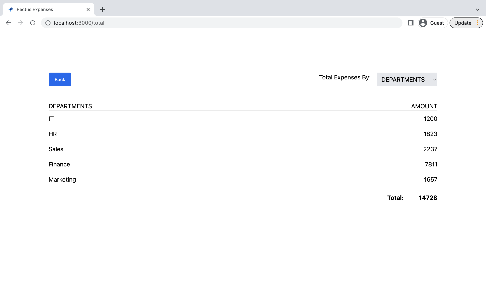

## Pectus finance frontend Task

Below is a picture of the firstpage displaying Table with the expenses data

Clicking on each header column will format the table in ascending/descending order according to the data in that header

I also implemented Pagination on the the table. You can go through the whole table by clicking on the next and prev buttons

The Go to total button takes you to the second page 

Here I implemented a detail calculation on each of the data based on there individual amounts

The Dropdown select shows the data from the other sections too

## How to run
`yarn install`  
`yarn start`  
`yarn Test` - To run tests  

## Notable External Packages I used 

### Tailwind-css

I used tailwind-css for the design aspect of the project, although it can make the code more bulky
it also makes for efficiency and faster development.

### React-papaparse

I used this for getting and parsing the csv data

### Others

Eslint - for Code linting  
Prettier -  for better Code Formatting  
React-router-dom - for navigation  
Jest - for Testing  

## Challenges

Css-in-js - Not really much of a challenge. But I think its slow for developement compared to tailwind-css

Combining Typescript with some packages - This is by far the most challenging thing I encountered as some the packages I used could do better with typechecking.

